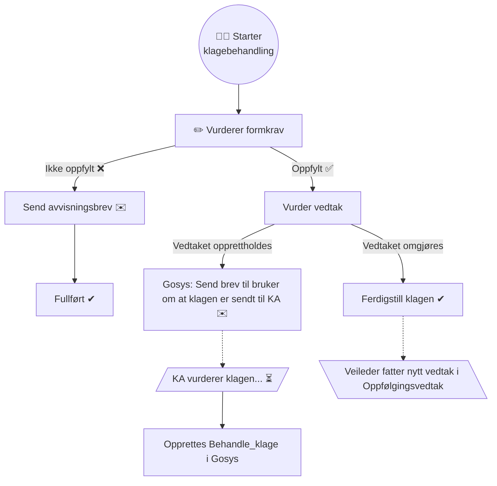

```mermaid
flowchart TD
start((👩‍💼 Starter
klagebehandling)) --> formkrav[✏️ Vurderer formkrav]
formkrav -->|Ikke oppfylt ❌ | brev[Send avvisningsbrev ✉️]
brev --> fullført[Fullført ✔︎]
formkrav -->|Oppfylt ✅ | vedtak[Vurder vedtak]
vedtak -->|Vedtaket omgjøres| ferdigstill[Ferdigstill klagen ✔︎]
vedtak -->|Vedtaket opprettholdes| kaBrev[Gosys: Send brev til bruker om at klagen er sendt til KA ✉️]
kaBrev -.-> kaVurderer[/KA vurderer klagen... ⏳/]
kaVurderer --> opprettOppgave[Opprettes Behandle_klage i Gosys]
ferdigstill -.-> rnyttVedtak[\Veileder fatter nytt vedtak i Oppfølgingsvedtak\]
```
