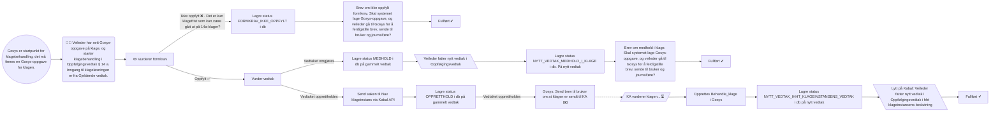

```mermaid
flowchart LR

start((Gosys er startpunkt for klagebehandling, det må finnes en Gosys-oppgave for klagen.))
    --> klageStart

klageStart(👩‍💼 Veileder har sett Gosys-oppgave på klage, og starter
klagebehandling i Oppfølgingsvedtak § 14 a. Inngang til klageløsningen er fra Gjeldende vedtak.)
    --> formkrav

formkrav[✏️ Vurderer formkrav]

formkrav -->|Ikke oppfylt ❌ . Det er kun klagefrist som kan være gått ut på 14a-klager? | lagringIOF

lagringIOF[Lagre status FORMKRAV_IKKE_OPPFYLT i db]
    --> brevIOF

brevIOF[Brev om ikke oppfylt formkrav. Skal systemet lage Gosys-oppgave, og veileder gå til Gosys for å ferdigstille brev, sende til bruker og journalføre?]
    --> fullførtIOF

fullførtIOF[Fullført ✔︎]
fullførtMH[Fullført ✔︎]
fullførtOPH[Fullført ✔︎]


formkrav -->|Oppfylt ✅ | vedtak

vedtak[Vurder vedtak]

vedtak -->|Vedtaket omgjøres| lagringMH

lagringMH[Lagre status MEDHOLD i db på gammelt vedtak] --> nyttVedtakMH
nyttVedtakMH[\Veileder fatter nytt vedtak i Oppfølgingsvedtak\] --> lagringNyttVedtakMH
lagringNyttVedtakMH[Lagre status NYTT_VEDTAK_MEDHOLD_I_KLAGE i db. På nytt vedtak] --> brevMH
brevMH[Brev om medhold i klage. Skal systemet lage Gosys-oppgave, og veileder gå til Gosys for å ferdigstille brev, sende til bruker og journalføre?]
    --> fullførtMH

vedtak -->|Vedtaket opprettholdes| sendTilKabal
sendTilKabal[Send saken til Nav klageinstans via Kabal API] --> lagringOPH

lagringOPH[Lagre status OPPRETTHOLD i db på gammelt vedtak]
    -->|Vedtaket opprettholdes| kaBrev

kaBrev[Gosys: Send brev til bruker om at klagen er sendt til KA ✉️]
    -.-> kaVurderer

kaVurderer[/KA vurderer klagen... ⏳/]
    --> opprettOppgave

opprettOppgave[Opprettes Behandle_klage i Gosys] --> lagringNyttVedtakOPH

lagringNyttVedtakOPH[Lagre status NYTT_VEDTAK_IHHT_KLAGEINSTANSENS_VEDTAK i db på nytt vedtak] --> nyttVedtakOPH
nyttVedtakOPH[\Lytt på Kabal: Veileder fatter nytt vedtak i Oppfølgingsvedtak i hht klageinstansens beslutning\] --> fullførtOPH

```
